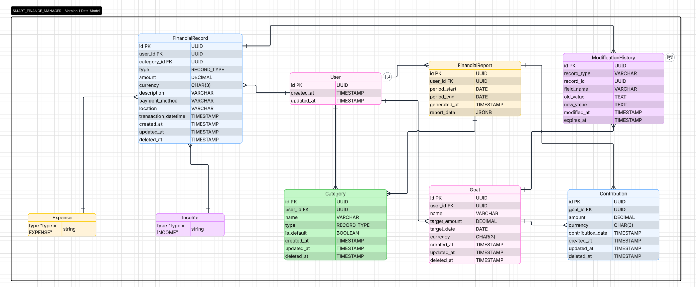

# Database Design

## Introduction

The following diagram represents the **Entity-Relationship Diagram (ERD)** of **Smart Finance Manager - Version 1 Data Model**.

This model defines the core structure of the system’s database. It includes the main entities, their attributes, primary keys, foreign keys, and the relationships between them.

### Main Entities

- **User**: Central entity that represents the system users. All other main entities belong to a user.
- **FinancialRecord**: Stores all financial transactions (both income and expenses). It is specialized into **Income** and **Expense**.
- **Category**: Allows users to classify their financial records.
- **Goal**: Represents financial goals set by the user.
- **Contribution**: Records the amounts contributed toward a specific goal.
- **FinancialReport**: Stores generated financial reports for a specific period.
- **ModificationHistory**: Keeps a history of changes made to important records (polymorphic relationship).

### Relationships

| Relationship                        | Cardinality | Description                                      |
|-------------------------------------|-------------|--------------------------------------------------|
| User → FinancialRecord              | 1 : N       | A user can have many financial records           |
| User → Category                     | 1 : N       | A user can create many categories                |
| User → Goal                         | 1 : N       | A user can create many goals                     |
| User → FinancialReport              | 1 : N       | A user can generate many financial reports       |
| Category → FinancialRecord          | N : 1       | A category can be used in many financial records |
| Goal → Contribution                 | 1 : N       | A goal can receive many contributions            |
| FinancialRecord → ModificationHistory | 1 : N     | A financial record can have many change records  |
| Goal → ModificationHistory          | 1 : N       | A goal can have many change records              |

### Special Notes

- **Inheritance**: `FinancialRecord` is specialized into `Income` and `Expense` using the `type` field.
- **ModificationHistory** is a polymorphic table (uses `record_type` + `record_id`) to track changes on different entities.
- Soft delete is implemented in several tables through the `deleted_at` field.