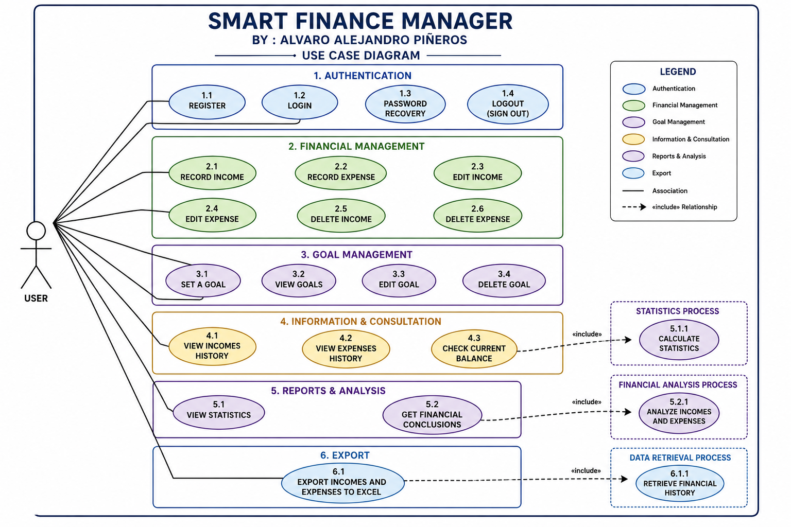

# 🏗️ Project Architecture

> This document describes the architectural design of **SMART_FINANCE_MANAGER**.  
> It focuses on the system structure, design decisions, and software diagrams that define the application's architecture.

---

# 📖 1. Overview

SMART_FINANCE_MANAGER is designed following a **Monolithic Layered Architecture** with a strong emphasis on **Object-Oriented Programming (OOP)** and **Separation of Concerns**.

The project is being developed incrementally. The business logic will be implemented first through a terminal application, allowing the core functionality to be fully validated before moving to graphical interfaces.

Future interfaces, such as the desktop and mobile applications, will reuse the same business logic, reducing code duplication and improving maintainability.

---

# 🎯 2. Architecture Goals

The architecture has been designed with the following objectives:

- 🧩 Keep business logic independent from the user interface.
- 📦 Promote modularity and maintainability.
- 🔄 Reuse the same core logic across different platforms.
- 🧪 Facilitate testing and future improvements.
- 📈 Support future scalability without major architectural changes.

---

# 📚 3. Software Diagrams

The following diagrams describe the architecture and design of the system.

## 📌 Use Case Diagram

This diagram defines the interactions between the user and the system, describing the main functionalities available in the application.

---

## 🏛️ UML Class Diagram

> 🚧 **In Progress**

This diagram will describe the domain model, including classes, attributes, methods, and relationships between the main business entities.

---

## 🗄️ Entity Relationship Diagram (ERD)

> 🚧 **In Progress**

This diagram will represent the database structure, including entities, relationships, primary keys, and foreign keys.